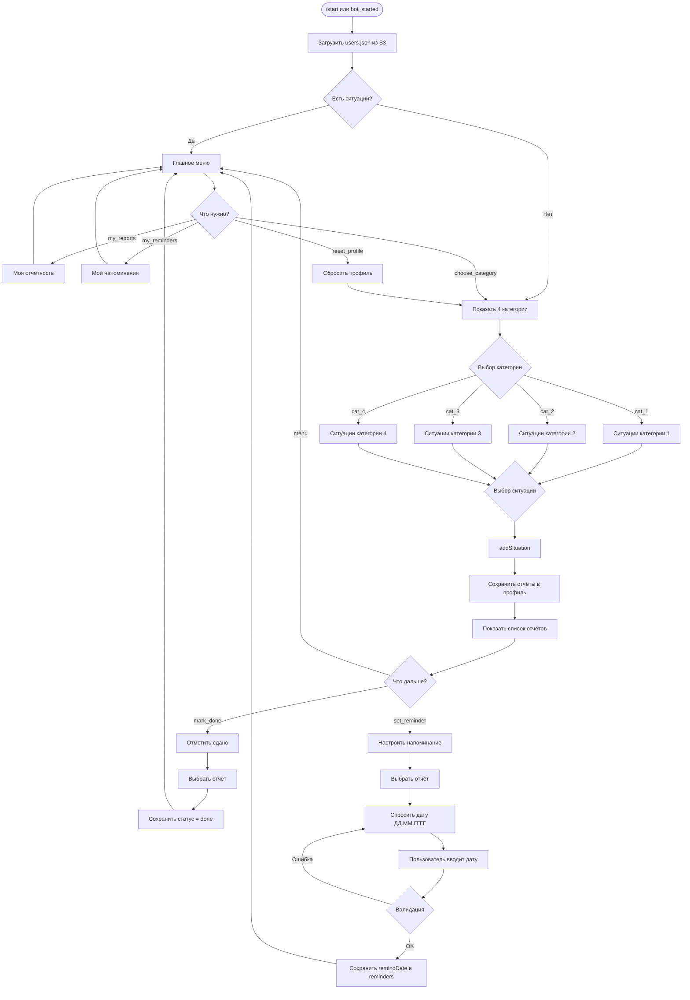

  # Tax Reminder Bot — Навигатор по изменениям для ИП

Чат-бот в MAX, который помогает ИП на УСН с сотрудниками разобраться, какие новые отчёты появились после изменений в бизнесе (найм сотрудника, смена режима, покупка транспорта).

## Назначение решения

ИП на УСН с сотрудниками часто **не знает**, что после изменения ситуации (найм первого сотрудника, смена режима налогообложения, покупка транспорта) у него **появились новые обязанности** по отчётности. Он гуглит устаревшие статьи, спрашивает в чатах, боится штрафов.

**Бот решает эту проблему:**

- Спрашивает, что изменилось.
- Показывает, какие новые отчёты появились.
- Указывает сроки, документы и штрафы.
- Помогает настроить напоминания.
- Хранит профиль пользователя.

## Целевая аудитория

ИП на УСН с сотрудниками (1–15 человек) в Республике Татарстан.

## Основной пользовательский сценарий

1. Пользователь отправляет `/start`.
2. Бот приветствует и спрашивает: «Что у вас изменилось?»
3. Пользователь выбирает ситуацию (нанял сотрудника / сменил режим / купил транспорт / ничего).
4. Бот показывает список отчётов: название, срок, документы, штраф.
5. Пользователь может:
   - ✅ Отметить отчёт «сдано».
   - 🔔 Настроить напоминание.
   - 🏠 Вернуться в меню.
6. При возврате бот помнит ситуацию и показывает меню:
   - 📋 Моя отчётность (список отчётов со статусами).
   - 🔔 Мои напоминания.
   - 🔄 Изменить ситуацию.

## Состав и архитектура решения

```
ProjectBot/
├── .dockerignore      # Файлы, исключаемые из Docker-образа
├── .env               # Токен бота (НЕ коммитится)
├── .env.example       # Шаблон переменных окружения
├── .gitignore         # Игнорируемые файлы
├── Dockerfile         # Сборка Docker-образа
├── README.md          # Документация проекта
├── bot.js             # Логика бота: команды, обработчики, меню
├── data.js            # База знаний: ситуации → отчёты → сроки → штрафы
├── docker-compose.yml # Запуск бота одной командой
├── package-lock.json  # Фиксация версий зависимостей
└── package.json       # Зависимости и скрипты
```

**Архитектура:**

- MAX Bot API — среда взаимодействия с пользователем.
- Node.js + @maxhub/max-bot-api — среда выполнения.
- data.js — статическая база знаний (подготовленные данные).
- Yandex Object Storage — хранение данных пользователей.
- Yandex Cloud Functions — среда выполнения 24/7.

### Логика работы бота



## Запуск через Docker

### Предварительно

Создай файл `.env` в корне проекта:

```
BOT_TOKEN=твой_токен_от_MAX
```

### Одна команда для запуска

```bash
docker-compose up --build
```

После запуска бот готов принимать сообщения в MAX.

### Остановка и повторный запуск

Остановить:

```bash
docker-compose down
```

Запустить снова:

```bash
docker-compose up
```

## Необходимые параметры окружения

| Переменная | Описание | Пример |
| --- | --- | --- |
| `BOT_TOKEN` | Токен бота из MAX | `1234567890:ABC...` |
| `NODE_TLS_REJECT_UNAUTHORIZED` | Отключение проверки SSL | `0` |

## Используемые порты

Бот работает через **Webhook** и не требует открытых портов для входящих соединений. Исходящие запросы идут на `https://platform-api2.max.ru`.

## Зависимости

- `@maxhub/max-bot-api` — библиотека для работы с MAX Bot API.
- `dotenv` — загрузка переменных окружения из `.env`.
- `@aws-sdk/client-s3` — работа с Yandex Object Storage.

Все зависимости зафиксированы в `package.json` и `package-lock.json`.

## Внешние сервисы и интеграции

- **Yandex Cloud Functions** — среда выполнения бота 24/7.
- **Yandex Object Storage** — хранение данных пользователей (файл `users.json`).

База отчётов (`data.js`) — **подготовленные данные**, составленные на основе открытых источников:

- Налоговый кодекс РФ.
- Сайт ФНС России.
- Сайт СФР России.
- Портал МСП.РФ.

**В MVP не используются реальные интеграции с ФНС, СФР или другими системами.** Все данные — тестовые / подготовленные.

## Работа с данными

- Данные пользователей (ситуации, отчёты, напоминания) хранятся в **Yandex Object Storage** (файл `users.json`).
- Данные **сохраняются между перезапусками** функции.

## Порядок работы с тестовыми данными

1. Открой бота в MAX.
2. Отправь `/start`.
3. Выбери ситуацию: «Нанял сотрудника».
4. Бот покажет 5 отчётов: ПСВ, РСВ, 6-НДФЛ, ЕФС-1 (кадры), ЕФС-1 (взносы).
5. Нажми «Настроить напоминание» → выбери отчёт → введи дату в формате `ДД.ММ.ГГГГ`.
6. Бот подтвердит: «✅ Сохранено! Напомню ...».

## Пошаговый сценарий проверки

1. **Запуск бота:**

   ```bash
   docker-compose up --build
   ```

2. **В MAX:**
   - Найди бота по нику.
   - Отправь `/start`.

3. **Первый сценарий:**
   - Нажми «👤 Нанял сотрудника».
   - Проверь, что бот показал 5 отчётов.
   - Нажми «✅ Отметить сдано».
   - Выбери «1. ПСВ».
   - Проверь: «✅ Записал: ПСВ сдан».

4. **Второй сценарий:**
   - Нажми «🏠 В меню».
   - Нажми «📋 Моя отчётность».
   - Проверь: ПСВ — ✅ сдано, остальные — ❌ не сдано.

5. **Третий сценарий:**
   - Нажми «🏠 В меню».
   - Нажми «🔔 Настроить напоминание».
   - Выбери отчёт → введи дату.
   - Проверь: «✅ Сохранено!».

## Примеры ожидаемого поведения системы

| Действие пользователя | Ожидаемый ответ бота |
| --- | --- |
| `/start` (первый раз) | Приветствие + 4 кнопки ситуаций |
| `/start` (повторно) | Меню с 3 опциями |
| Выбор ситуации | Список отчётов с сроками и штрафами |
| «Отметить сдано» | Запрос: «Какой отчёт сдали?» |
| Выбор отчёта | «✅ Записал: [название] сдан.» |
| «Настроить напоминание» | Запрос: «По какому отчёту напомнить?» |
| Выбор отчёта | Запрос даты |
| Ввод даты | «✅ Сохранено! Напомню ...» |
| «Моя отчётность» | Список отчётов со статусами |
| «Мои напоминания» | Список активных напоминаний |

## Известные ограничения

1. **Напоминания не отправляются автоматически.** В MVP только сохраняются. Для отправки нужен Timer Trigger.
2. **Нет реальных интеграций с ФНС и СФР.** База отчётов — подготовленные данные.
3. **Только ИП на УСН с сотрудниками.** Другие режимы не поддерживаются.
4. **Только 3 ситуации.** Другие изменения (открытие ОКВЭД, покупка оборудования) не обрабатываются.

## Потенциал масштабирования

**Ядро продукта (не меняется):**

- Логика диалога.
- Структура профиля.
- Алгоритм показа отчётов.
- Механика напоминаний.

**Переменная часть (адаптируется):**

- База отчётов (`data.js`).
- Региональные особенности.
- Сроки и штрафы.

**Условия адаптации для нового региона:**

1. Обновить `data.js` с региональными отчётами.
2. Изменить сроки и штрафы (если отличаются).
3. Код бота **не меняется**.

## Использованные источники

- Налоговый кодекс РФ.
- [ФНС России](https://www.nalog.gov.ru/) — сроки и формы отчётности.
- [СФР России](https://sfr.gov.ru/) — ЕФС-1, ПСВ.
- [Портал МСП.РФ](https://мсп.рф/) — меры поддержки.
- [MAX для партнёров](https://dev.max.ru/) — документация API.
- Единый реестр субъектов МСП (ФНС).

## Команда

- **Автор:** Сайгафарова Карина
- **Хакатон:** Эффективный бизнес, 2026
- **Трек:** Цифровые решения для бизнеса

## Лицензия

MIT.

---

**Дата актуальности данных:** октябрь 2026.
**Версия:** MVP 1.0.