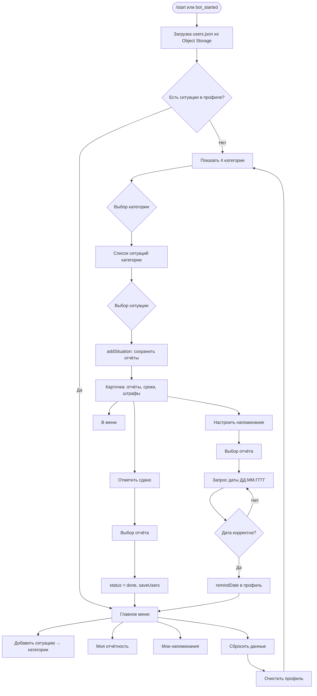
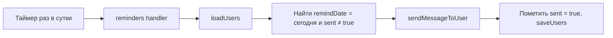

# Tax Reminder Bot — Навигатор по отчётности для ИП

Чат-бот в мессенджере **MAX**, который помогает ИП на УСН с сотрудниками понять, **какие отчёты появились** после изменений в бизнесе, **когда их сдавать** и **не забыть о сроках**.
Ссылка на бота в MAX: [[@t825_hakaton_max_bot](https://max.ru/t825_hakaton_max_bot)]
Репозиторий: [github.com/Saigafarova/Tax_Reminder_Bot](https://github.com/Saigafarova/Tax_Reminder_Bot)

---

## Назначение

ИП с микробизнесом часто не знает, что после найма сотрудника, договора ГПХ, увольнения или конца квартала появляются новые обязанности (ЕФС-1, ПСВ, РСВ, 6‑НДФЛ и др.). Поиск в интернете даёт устаревшие статьи, риск — штрафы.

**Бот:**

- ведёт по сценарию «что случилось → какие отчёты»;
- показывает срок, документы и возможный штраф;
- позволяет отметить «сдано» и поставить напоминание на дату;
- **сам пишет в MAX** в нужный день (отдельная Cloud Function + таймер);
- хранит профиль в Yandex Object Storage (не забывает между сессиями).

> Важно: Сроки и штрафы — типовые ориентиры по открытым источникам. Перед сдачей сверяйте в ЛК ФНС/СФР или с бухгалтером.

---

## Целевая аудитория

ИП на УСН с сотрудниками (примерно 1–15 человек), в том числе начинающие предприниматели в Республике Татарстан и других регионах РФ.

---

## Основной пользовательский сценарий

1. Пользователь открывает бота или отправляет `/start` (также обрабатывается событие `bot_started`).
2. Если профиль пустой — бот показывает **4 категории**:
   - Приём на работу  
   - Выплаты и налоги  
   - Больничные и соцслучаи  
   - Увольнение и особые случаи  
3. Пользователь выбирает **ситуацию** внутри категории (например, «Приём сотрудника по трудовой»).
4. Бот показывает **список отчётов**: название, срок, документы, штраф.
5. Дальше можно:
   - отметить отчёт «сдано»;
   - настроить напоминание (дата в формате `ДД.ММ.ГГГГ`);
   - вернуться в меню.
6. Если в профиле уже есть ситуации — открывается **главное меню**:
   - Добавить ситуацию  
   - Моя отчётность  
   - Мои напоминания  
   - Сбросить данные  

**Автонапоминания:** раз в сутки отдельная функция читает `users.json`, находит напоминания на сегодня и отправляет сообщение в MAX.

---

## Состав репозитория

```
Tax_Reminder_Bot/
├── index.js              # Основной бот (webhook, Cloud Functions)
├── data.js               # Категории, ситуации, отчёты
├── package.json
├── reminders/            # Job автонапоминаний
│   ├── index.js
│   └── package.json
├── bot.js                # для локальной разработки
├── Dockerfile
├── docker-compose.yml
├── .env.example
└── README.md
```

**Продакшен-архитектура:**

| Компонент | Роль |
|-----------|------|
| MAX Bot API | Диалог с пользователем (webhook) |
| Yandex Cloud Functions | `index.handler` — основной бот |
| Yandex Cloud Functions + Timer | `reminders` — ежедневная рассылка |
| Yandex Object Storage | `users.json` — профили, отчёты, напоминания |
| `data.js` | База знаний (категории → ситуации → отчёты) |

```
MAX  --POST update-->  Cloud Function (бот)
                              |
                              v
                       Object Storage
                       (users.json)
                              ^
                              |
Timer (cron) --> Cloud Function (reminders) --> sendMessageToUser
```

---

## Логика диалога (для блок-схемы)


```mermaid
flowchart TD
  Start(["/start или bot_started"]) --> Load[Загрузка users.json из Object Storage]
  Load --> HasData{Есть ситуации в профиле?}

  HasData -->|Нет| Cats[Показать 4 категории]
  HasData -->|Да| Menu[Главное меню]

  Cats --> CatChoice{Выбор категории}
  CatChoice --> Sits[Список ситуаций категории]
  Sits --> SitChoice{Выбор ситуации}
  SitChoice --> Add[addSituation: сохранить отчёты]
  Add --> Card[Карточка: отчёты, сроки, штрафы]

  Card --> A1[Отметить сдано]
  Card --> A2[Настроить напоминание]
  Card --> A3[В меню]

  A1 --> PickDone[Выбор отчёта]
  PickDone --> SaveDone[status = done, saveUsers]
  SaveDone --> Menu

  A2 --> PickRem[Выбор отчёта]
  PickRem --> AskDate[Запрос даты ДД.ММ.ГГГГ]
  AskDate --> Valid{Дата корректна?}
  Valid -->|Нет| AskDate
  Valid -->|Да| SaveRem[remindDate в профиль]
  SaveRem --> Menu

  Menu --> M1[Добавить ситуацию → категории]
  Menu --> M2[Моя отчётность]
  Menu --> M3[Мои напоминания]
  Menu --> M4[Сбросить данные]

  M4 --> Wipe[Очистить профиль]
  Wipe --> Cats
```

Фоновый процесс, не в диалоге:


```mermaid
flowchart LR
  T[Таймер раз в сутки] --> R[reminders handler]
  R --> L[loadUsers]
  L --> F[Найти remindDate = сегодня и sent ≠ true]
  F --> S[sendMessageToUser]
  S --> M[Пометить sent = true, saveUsers]
```

---

## Категории и ситуации (data.js)

| Категория | Примеры ситуаций |
|-----------|------------------|
| Приём на работу | Трудовая книжка; ГПХ; иностранец с патентом |
| Выплаты и налоги | ПСВ; конец квартала (РСВ, 6‑НДФЛ, травматизм); декларация УСН |
| Больничные и соцслучаи | Больничный; декрет; подтверждение ОВЭД |
| Увольнение и особые случаи | Увольнение; иностранец; окончание ГПХ |

У части ситуаций несколько отчётов

---

## Переменные окружения

| Переменная | Назначение |
|------------|------------|
| `BOT_TOKEN` | Токен бота MAX |
| `S3_BUCKET` | Имя бакета Object Storage |
| `S3_ACCESS_KEY_ID` | Ключ доступа |
| `S3_SECRET_ACCESS_KEY` | Секретный ключ |
| `S3_ENDPOINT` | `https://storage.yandexcloud.net` |
| `S3_REGION` | `ru-central1` |

Одинаковый набор переменных задаётся и для основной функции, и для `reminders`.

---

## Запуск через Docker

Для **локальной разработки** и **проверки** решение можно запустить через Docker.

### Dockerfile

```dockerfile
FROM node:20-alpine

WORKDIR /app

COPY package*.json ./

RUN npm install --production

COPY . .

CMD ["node", "index.js"]
```

### docker-compose.yml

```yaml
version: '3.8'

services:
  bot:
    build: .
    container_name: tax-reminder-bot
    restart: unless-stopped
    env_file:
      - .env
```

### .dockerignore

```
node_modules
.env
.git
.gitignore
README.md
*.md
```

### .env.example

```
BOT_TOKEN=your_token_here
S3_BUCKET=your_bucket_name
S3_ACCESS_KEY_ID=your_access_key
S3_SECRET_ACCESS_KEY=your_secret_key
S3_ENDPOINT=https://storage.yandexcloud.net
S3_REGION=ru-central1
```

### Одна команда для запуска

Перед запуском создай файл `.env` в корне проекта (на основе `.env.example`) с реальными значениями.

Затем выполни:

```bash
docker-compose up --build
```

После запуска основной пользовательский сценарий доступен в MAX.

### Остановка

```bash
docker-compose down
```

### Повторный запуск

```bash
docker-compose up
```

### Важно

- Docker-конфигурация подготовлена для **воспроизводимого запуска**. 
- Основная версия бота работает через **Yandex Cloud Functions** (webhook + таймер). 
- Docker — **альтернативный вариант** для локальной разработки и проверки.

---

## Деплой в Yandex Cloud

### Основной бот

1. Собрать ZIP из корня: `index.js`, `data.js`, `package.json`, `node_modules`.
2. Cloud Functions → runtime **nodejs22**, точка входа **`index.handler`**.
3. Включить **публичную функцию**, прописать env.
4. Зарегистрировать webhook в MAX на URL функции  
   (`POST /subscriptions` с `update_types`: `message_created`, `bot_started`, `message_callback`).

### Автонапоминания

1. ZIP из папки `reminders/`.
2. Отдельная функция, точка входа **`index.handler`**, те же env.
3. Триггер типа **Таймер** (например, каждый день в 9:00 МСК ≈ `0 0 6 * * ?` UTC — уточнить формат в консоли).
4. Сервисный аккаунт с правом вызова функции и доступом к бакету.

### Проверка

1. `/start` → 4 категории.  
2. Ситуация → список отчётов → напоминание на **сегодня**.  
3. Тест функции `reminders` или ожидание таймера → сообщение в MAX.  
4. «Сбросить данные» → снова экран категорий.

---

## Зависимости

- `@maxhub/max-bot-api` — MAX Bot API  
- `@aws-sdk/client-s3` — Object Storage  
- `dotenv` — локальные переменные (в облаке используются env функции)

---

## Работа с данными

Профиль пользователя в `users.json`:

```json
{
  "12345678": {
    "situations": ["hire_main_employee"],
    "reports": [
      { "id": "efs_hire", "name": "...", "status": "not_done", "deadline": "...", "documents": [], "penalty": "..." }
    ],
    "reminders": [
      { "reportId": "efs_hire", "remindDate": "2026-10-22", "sent": false }
    ],
    "waitingForDate": null
  }
}
```

---

## Примеры ответов бота

| Действие | Ответ бота |
|----------|------------|
| `/start` (новый пользователь) | 4 кнопки категорий + дисклеймер |
| `/start` (есть профиль) | Главное меню |
| Выбор категории | Список ситуаций раздела |
| Выбор ситуации | Карточка отчётов (срок, документы, штраф) |
| «Отметить сдано» → отчёт | «Записал: … сдан» |
| «Настроить напоминание» → дата | «Сохранено! Напомню ДД.ММ.ГГГГ…» |
| Job reminders | «Напоминание… Сегодня дата… по отчёту …» |
| «Сбросить данные» | Профиль очищен → категории |

---

## Известные ограничения

1. Нет прямой интеграции с ЛК ФНС/СФР — только подготовленная база в `data.js`.  
2. Ставка УСН 6%/15% не ветвит сценарии (влияет в основном на расчёт УСН, не на кадровые формы).  
3. Один файл `users.json` — при очень высокой одновременной нагрузке возможны гонки записи (для MVP достаточно).  
4. Юридические формулировки нужно периодически сверять с актуальными нормами.

---

## Потенциал развития

- Расширение `data.js` (десятки ситуаций из полной базы).  
- Админ-режим для правок справочника без деплоя.  
- Хранение `users/{userId}.json`.  
- Онбординг: «есть сотрудники? / УСН 6 или 15?».  
- Напоминание «за 3 дня» и «в день срока».

**Ядро** (диалог, профиль, напоминания) не меняется — меняется в основном контент.

---

## Источники

- Налоговый кодекс РФ  
- [ФНС России](https://www.nalog.gov.ru/)  
- [СФР России](https://sfr.gov.ru/)  
- [МСП.РФ](https://мсп.рф/)  
- [MAX для разработчиков](https://dev.max.ru/)  

---

## Команда

- **Автор:** Сайгафарова Карина  
- **Хакатон:** Эффективный бизнес, 2026  
- **Трек:** цифровые решения для бизнеса  

## Лицензия

MIT

**Версия:** MVP 1.1  
**Актуальность данных:** сентябрь 2026  
```
